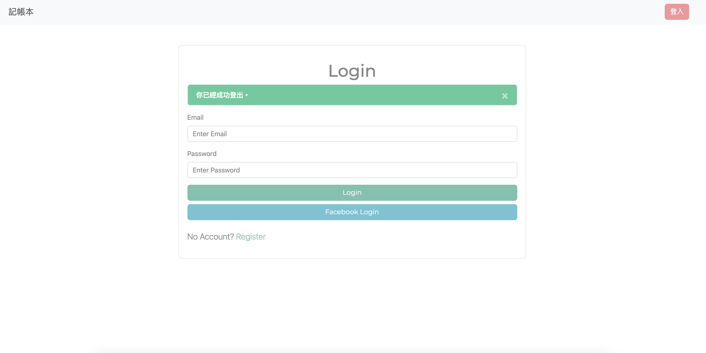
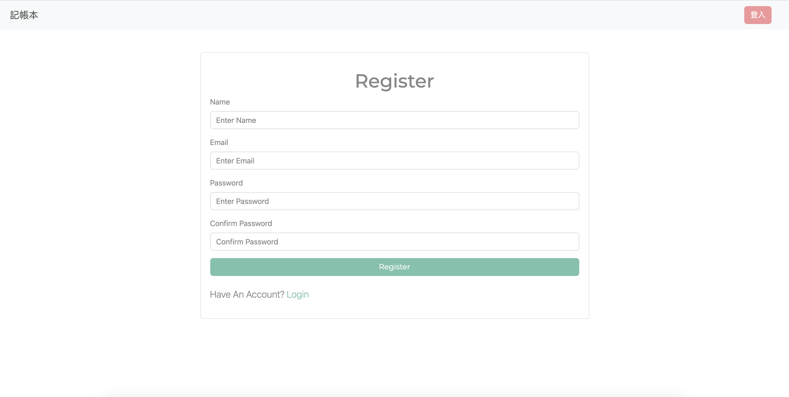
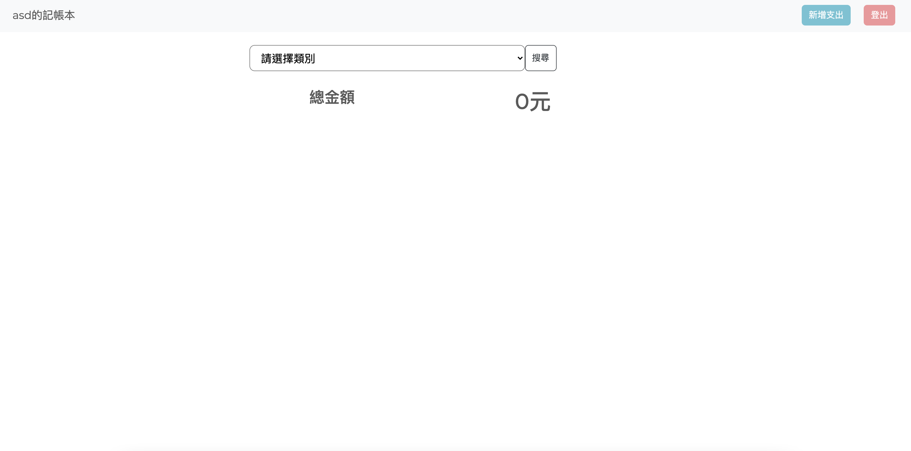
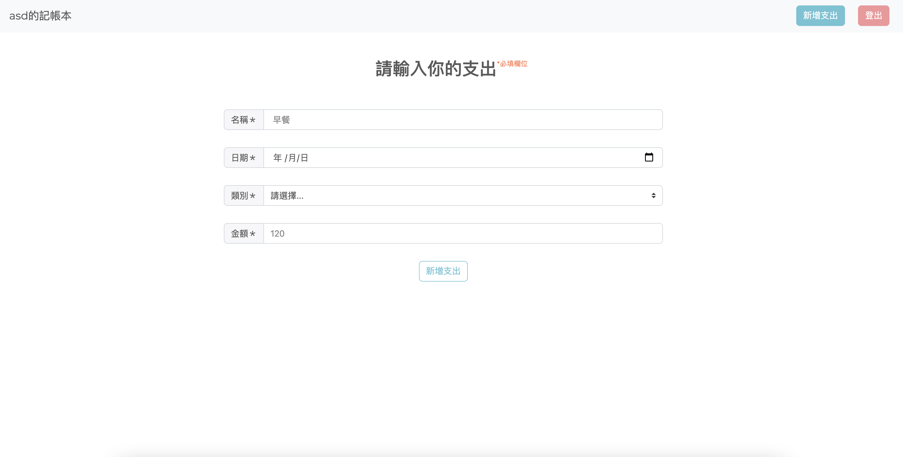
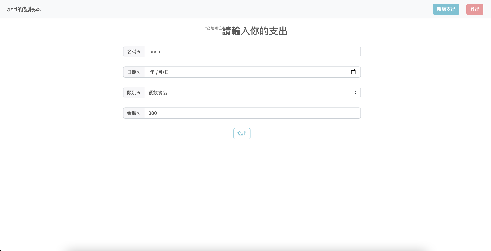
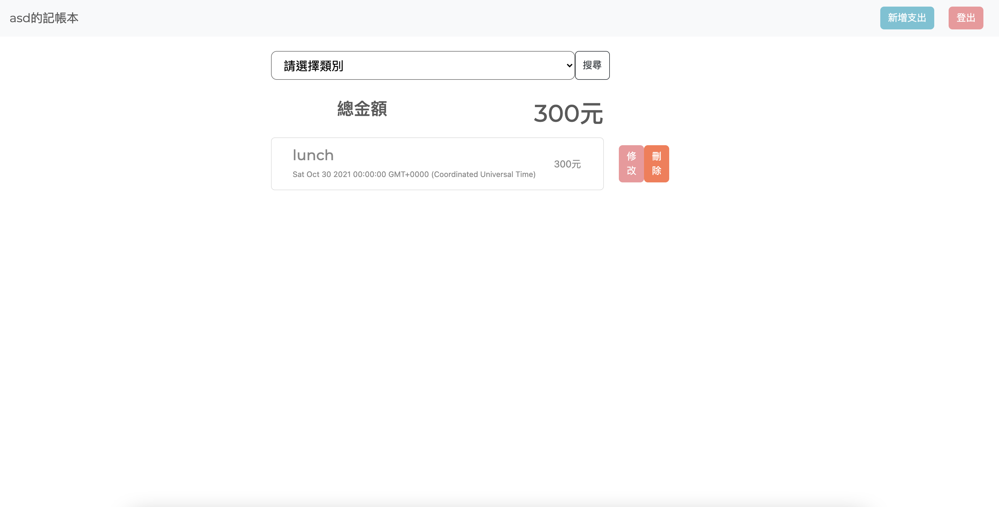

# 私家記帳本
使用Express製作的記帳網路應用程式

### :link: heroku 連結
https://expensetrackermartin.herokuapp.com/

## 功能
1. 使用者可以註冊、登入及登出
2. 使用者可以使用facebook第三方登入
3. 使用者可以新增、修改、刪除及瀏覽消費紀錄
4. 使用者可以透過分類欄位瀏覽特定類別的消費紀錄
5. 自動加總當頁面消費的金額 

## 網頁圖示
*登入頁

*註冊頁

*首頁

*新增頁

*修改頁

*修改頁

## 安裝與執行步驟
1. 使用終端機，clone此專案到local位置

        git clone https://github.com/Martin-no1tw/expense-tracker.git

2. 使用終端機，進入此專案所在的資料夾

        cd expense-tracker

3. 安裝套件

        npm install
4. 安裝mongodb並在mongodb內建立資料庫expense-tracker
5. 新增種子資料

        npm run seed

6. 啟動伺服器

        npm run dev
        
7. 看到以下字樣代表成功啟動並監聽server以及成功連上資料庫

        This is running on http://localhost:3000
        mongodb connected!
        
   在任一瀏覽器輸入localhost:3000即可進入網站
   
## 測試資料
- 人員資料

| name            | email    | password |
| --------------- | -------- |----------|
| user1          | user1@example.com     | 12345678  |
  
## 環境與套件
* 環境：[Node.js](https://nodejs.org/en/)
* 框架：[Express](https://expressjs.com/)
* 樣板：[handlebars](https://www.npmjs.com/package/express-handlebars)
* 套件：[Bootswap](https://bootswatch.com/4/)
* 套件：[Popper.js](https://popper.js.org/)
* 套件：[Jquery.js(3.6.0.min)](https://jquery.com/)
* 套件：[mongoose](https://mongoosejs.com/)
* 套件：[method-override](https://www.npmjs.com/package/method-override)
* 資料庫：[mongodb](https://www.mongodb.com/)